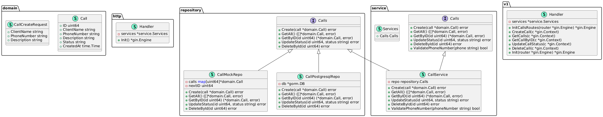

<p align="center"></p>

<h1 align="center">Call Center Api</h1>
<p align="center"><b>Call Center Api</b> это простое веб-приложение на Go с использованием Gin для управления заявками колл-центра.</p>


---

# Описание
```txt
Приложение должно позволять добавлять, удалять и просматривать заявки.
Основной объект заявки
Объект заявки (например, Call) должен иметь следующие поля:
        ID: Уникальный идентификатор для каждой заявки, который генерируется в базе данных.
        ClientName: Имя клиента, подающего заявку. Должно быть обязательным полем.
        PhoneNumber: Номер телефона клиента для связи. Должен соответствовать определённому формату (например, включать только цифры и, возможно, знаки "+" или "-").
        Description: Подробное описание проблемы, с которой обратился клиент. Также должно быть обязательным полем.
        Status: Статус заявки, который может принимать значения "открыта" и "закрыта". Это поле может быть изменяемым при обновлении заявки и при создании иметь значение "открыта".
        CreatedAt: Дата и время создания заявки, что позволит отслеживать время обращения клиента.

Требования:

1. REST API:
    Создайте API с использованием фреймворка Gin.
    Реализуйте следующие эндпоинты:
        POST /calls — добавление новой заявки. Тело запроса должно содержать информацию о заявке.
        GET /calls — получение списка всех заявок.
        GET /calls/:id — получение информации по конкретной заявке по ID.
        PATCH /calls/:id/status — изменение статуса заявки по ID (например, на "закрыта").
        DELETE /calls/:id — удаление заявки по ID.

2. Хранение данных:
    Используйте базу данных PostgreSQL для хранения заявок.
    Пожалуйста, приложите SQL-файл с созданием структуры базы данных, включая таблицы и необходимые индексы.

3. Обработка ошибок:
    При добавлении новой заявки:
        Если поле ClientName или Description пустое, возвращайте статус 400 (Bad Request) с соответствующим сообщением.
        Если PhoneNumber не соответствует допустимому формату, также возвращайте статус 400.
    При удалении заявки:
        Если запрашиваемый ID не существует, возвращайте статус 404 (Not Found) с сообщением о том, что запись не найдена.
    При запросе информации по конкретной заявке:
        Если запрашиваемый ID не существует, возвращайте статус 404 (Not Found) с сообщением о том, что запись не найдена.
    При изменении статуса заявки:
        Если запрашиваемый ID не существует, возвращайте статус 404 (Not Found) с сообщением о том, что запись не найдена.
        Если новый статус не соответствует допустимым значениям (например, не "открыта" или "закрыта"), возвращайте статус 400 (Bad Request).

4. Тестирование:
    Напишите простые HTTP-тесты для вашего API.

5. Документация:
    Добавьте комментарии к коду и краткое описание, как запустить ваше приложение.

6. Docker:
    Напишите Docker-файл для сборки образа приложения.
    Укажите команды для сборки и запуска контейнера с приложением.
    
```

# Запуск

Конфигурация осуществляется через копирования файла `.env.example` в `.env` и указание необходимых настроек. Для Makfile нужно продублировать настройки из `.env` но без кавычек.

## Makefile
### Запуск
```shell
make run
```

### Сборка
```shell
make
```

### Тестирование
```shell
make test
```

## Docker
### Запуск
```shell
make docker
```

### Сборка
```shell
make docker_build_c
```

## Go

### Запуск
```shell
go run ./cmd/app/main.go
```

### Сборка
```shell
go build ./cmd/app/main.go -o ./bin
```

### Тестирование
```shell
go test -v ./...
```

# Описание функциональности

## Makefile
| Команда      | Описание                            |
|--------------|-------------------------------------|
| (без аргументов) | Сборка приложения в ./bin/          |
| install      | Установка утилит                    |
| air_w        | Запуск сервера с использованием air |
| run          | go run cmd/app/main.go              |
| build        | Сборка приложения в ./bin/          |
| tidy         | go mod tidy                         |
| test         | Запуск тестов                       |
| docker       | Запуск сервера в docker             |

## Postman тестирование
Файл `docs/call center.postman_collection.json`

